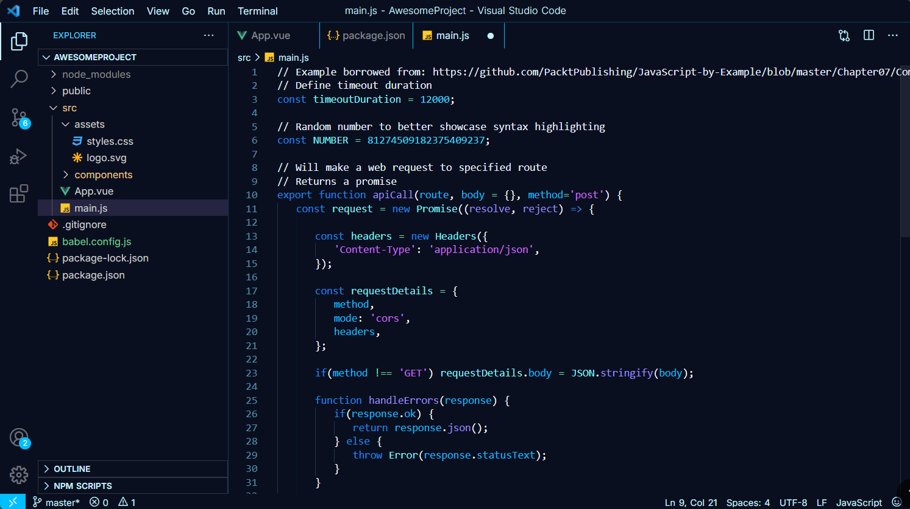

# Yelan-Theme
Yelan Theme is a custom Visual Studio Code dark theme inspired by the character Yelan from Genshin Impact.
The theme blends deep navy backgrounds, aqua highlights, and mystic violet accents to create a coding environment that is visually appealing, comfortable for long sessions, and true to Yelan’s elegant aesthetic.

**What I Did:**
Designed a color palette inspired by Yelan:
Aqua tones based on her eyes.
Violet-blue accents reflecting her subtle eyelashes.
Dark navy background for a sleek, immersive environment.
Configured the theme in a theme.json file for VS Code.
Mapped each UI element (keywords, strings, functions, variables, errors, etc.) to carefully chosen colors for clarity and balance.
Packaged the theme as a VS Code extension to allow easy installation and distribution.

**How I Did It:**
Theme JSON Creation
Started with VS Code’s theme JSON format.
Defined syntax highlighting and editor UI colors based on the Yelan palette.
Testing Locally
Ran the theme in VS Code’s Extension Development Host (F5).
Adjusted color contrasts to prevent blending and improve readability.
Packaging
Added a package.json file to describe the extension.
Created supporting files: .gitignore, LICENSE (MIT), and README.md.
Used vsce to package and test a .vsix version.

**Version Control & Publishing**
Uploaded project to GitHub for version control and collaboration.
Prepared the extension for publication to the VS Code Marketplace.

**Screenshots:**

**Installation:**
git clone https://github.com/SaiAkhil2006/Yelan-Theme.git
cd yelan-theme
code --install-extension yelan-theme-0.0.1.vsix

**License:**
This project is licensed under the MIT License.
